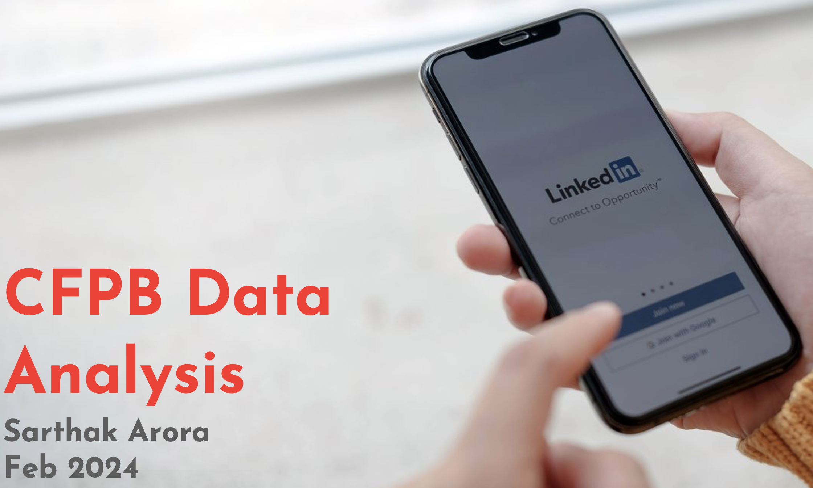

# Sentiment Analytics using Python

## Video Overview

In this video, I, **Sarthak Arora**, walk through a presentation I created to analyze customer complaints using **sentiment analysis (NLP)**. The deck is structured into four key sections:

- Data loading and cleaning  
- Insights from company responses  
- NLP analysis on issue and sub-issue columns  
- Summary of key insights  

You'll also see a quick data summary covering:
- Total number of records
- Unique products and companies
- Percentage of complaints that were closed

Click the image above or [watch the video here](https://www.loom.com/share/3bd0fad270004b1299afe312d9058812) to learn how sentiment analysis can help address customer concerns and strengthen a company’s reputation.
